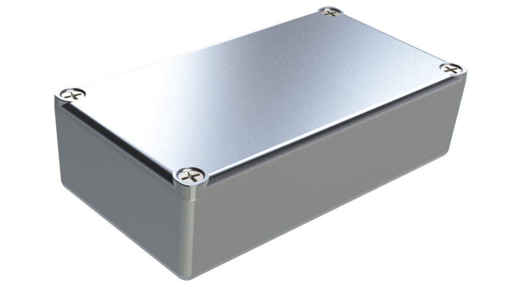

<!-- HTML Comment -->

<!-- GitHub Markdown / HTML Format Tips

* Line Breaks in Text
  <br/> for single break

* Link with spaces in file path
  [Link Text](/folder/file%20path%20with%20spaces)

* Link to a Heading
  [Link Text](#link-to-a-multi-word-heading)

* File paths must use forward slashes '/' to create useable relative links in GitHub

* Side-by-side images on GitHub
  <p float="left">
  
  
  </p>

* Clickable Image URL link must have HTML code on SAME LINE, for example:
  <a href="docs/schematic.pdf"></a>

* Embedded Video File
<video width="320" height="240" controls>
  <source src="img/video.mov" type="video/mp4">
</video>

* Code Block Syntax Highlighting tags:
  http://www.rubycoloredglasses.com/2013/04/languages-supported-by-github-flavored-markdown/
  ```cpp

* Emojis: copy-paste directly into text https://emojipedia.org/

* Table Generator: https://www.tablesgenerator.com/markdown_tables
  | header A | header B | header C |
  |----------|----------|----------|
  | item 1   | item 2   | item 3   |
-->

# Project Name

**Description**: Brief description of the project



---

## Using This Template

### Option A: GitHub Template (new repository)

Click **"Use this template"** on GitHub, or:

```bash
gh repo create your-org/your-project --template MattStarfield/_template-ai --private --clone
```

### Option B: Initialize Existing Project

```bash
~/scripts/init-claude-project.sh /path/to/existing/project
```

### After Creating

1. **Edit `CLAUDE.md`** — Fill in project-specific sections (overview, environment, architecture)
2. **Edit `README.md`** — Replace this content with your project's documentation
3. **Sync labels** — `~/scripts/labels/sync-labels.sh your-org/your-project`
4. **Delete unused directories** — Remove `firmware/`, `hardware/`, `software/` etc. if not needed
5. **Review examples** — Check `.claude/` examples, adapt or remove them

---

## Project Structure

| Directory | Purpose |
|-----------|---------|
| `.claude/` | Claude Code configuration (hooks, agents, commands, skills, templates) |
| `.github/` | GitHub templates (issues, PRs) |
| `claudedocs/` | Claude-generated reports, analyses, and documentation |
| `client_provided/` | Client-supplied assets and specifications |
| `docs/` | Human-authored documentation and guides |
| `firmware/` | Firmware source code (PlatformIO, Arduino) |
| `hardware/elec/` | Electronics design (KiCad schematics, PCB layouts) |
| `hardware/mech/` | Mechanical design (CAD files, drawings) |
| `img/` | Project images and assets |
| `scripts/` | Utility and maintenance scripts |
| `software/` | Application software |
| `tests/` | Test suite |
| `utils/` | Development utilities and drivers |

### Claude Code Examples

The `.claude/` directory includes working examples that demonstrate conventions:

| File | Demonstrates |
|------|-------------|
| `commands/example-deploy.md` | Slash command with 5-phase safety protocol |
| `skills/example-release-notes/SKILL.md` | Skill with frontmatter, phases, and approval gates |
| `agents/example-code-reviewer.md` | Agent with version header, inline execution, and scope limits |
| `hooks/example-dangerous-command-guard.py` | PreToolUse hook with pattern matching and JSON contract |
| `templates/example-workflow-phase.md` | Phase-based workflow template with decision gates |

### Archive Convention

Directories named `~archive/` are used for deprecated content that should be preserved
but is no longer active. This is preferred over deletion when historical reference
is needed beyond what git history provides.

---

### README Outline
* [**Documentation**](#documentation)
    * [User Documentation](#user-documentation)
    * [Developer Documentation](#developer-documentation)
* [**Hardware**](#hardware)
* [**Firmware**](#firmware)
* [**Software**](#software)

---

## Documentation

### User Documentation

<!-- Add links to user-facing guides -->
<!-- Example: [Guide: Command Line Interface](docs/guide_command_line_interface.md) -->

### Developer Documentation

<!-- Add links to developer guides -->
<!-- Example:
- [Firmware File Structure](docs/firmware_file_structure.md)
- [PlatformIO IDE Setup](docs/guide_platformio_ide.md)
- [Git Workflow with SourceTree](docs/guide_using_sourcetree_with_github.md)
-->

---

## Hardware

<!-- Add hardware documentation links -->
<!-- Example:
### Bill of Materials
[View BOM](hardware/elec/bom.csv)

### Electronics
- [Schematic PDF](docs/schematic.pdf)
- [KiCad Project](hardware/elec/kicad/)

### Mechanical
- [Enclosure Design](hardware/mech/)
-->

---

## Firmware

<!-- Add firmware documentation -->
<!-- Example:
- **Source**: [firmware/vs-code_platformio_ide/](firmware/vs-code_platformio_ide/)
- **Target Device**: [Device name]
- **IDE**: VS Code + PlatformIO
- **Framework**: Arduino
-->

---

## Software

<!-- Add software documentation -->
<!-- Example:
- **Source**: [software/](software/)
- **Framework**: [Framework name]
-->
